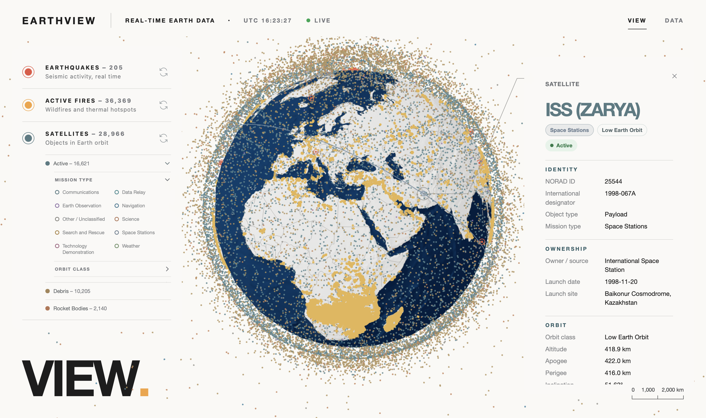

# EarthView

EarthView displays publicly available data in its geographic context on an interactive 3D globe.

EarthView-authored code is released under the MIT License. Bundled data, assets, and dependencies retain their own terms; the source and attribution for bundled data are summarized below and on the [data-source page](http://localhost:3000/data) when the app is running.



## What you can explore

| Layer | What it shows |
| --- | --- |
| Earthquakes | Recent earthquake locations, magnitude, depth, and event details. |
| Active fires | Near-real-time fire and thermal hotspot detections. |
| Orbital objects | Active satellites, debris, and rocket bodies, with filters and object details. Selecting the ISS shows live orbital telemetry and an embedded live Earth broadcast; playback starts in the YouTube player and the official NASA camera page remains available if the stream is temporarily unavailable. |
| Pipelines | Global gas and oil transmission routes, with independent fuel layers and status filters. |
| Geographic context | Country geography and land/seafloor relief shown on the globe. |

## Quick start and configuration

Run the backend and frontend in separate terminals.

The supported development versions are **Node.js 22** and **Python 3.14**. The matching version files are `.nvmrc` and `backend/.python-version`.

### 1. Prepare the local configuration

The backend reads `config.yaml` at startup, so create it from the template if it does not exist:

```bash
cp config.example.yaml config.yaml
```

The template placeholder lets the API start and serve the other feeds. To load active fires, request a free [NASA FIRMS MAP_KEY](https://firms.modaps.eosdis.nasa.gov/api/area/) and replace the placeholder in `firms.map_key`. The local file is gitignored; never commit or share the key. Restart the backend after changing it.

### 2. Start the API

```bash
cd backend
python -m venv .venv
source .venv/bin/activate
pip install -r requirements.txt
uvicorn app.main:app --reload
```

The API listens on `http://127.0.0.1:8000` by default.

### 3. Start the frontend

In a second terminal, from the repository root:

```bash
cd frontend
npm ci
npm run dev
```

Open [http://localhost:3000](http://localhost:3000). The frontend rewrites `/api/*` to `http://127.0.0.1:8000`. To use a different backend origin, set `EARTHVIEW_API_ORIGIN` before starting Next.js, for example:

```bash
EARTHVIEW_API_ORIGIN=http://127.0.0.1:8010 npm run dev
```

The data-source page is at [http://localhost:3000/data](http://localhost:3000/data).

## Run with Docker Compose

Docker and the Compose plugin are required. Ensure a root `config.yaml` exists; if needed, copy `config.example.yaml`. Replace its placeholder with a valid FIRMS MAP_KEY to load active-fire data. Compose mounts this local file read-only into the API container; the key is not copied into either image.

For production mode:

```bash
docker compose up --build
```

For development mode with source changes mounted for reload:

```bash
docker compose -f compose.yaml -f compose.dev.yaml up --build
```

Both modes serve the frontend at [http://localhost:3000](http://localhost:3000). The frontend reaches the API over Compose’s private network. Satellite cache files persist in a named volume across container restarts. Stop the services with `docker compose down`, using the same `-f` arguments for development mode.

Compose exposes the frontend on port 3000 and keeps the API private to the Compose network. The API has no authentication or rate limiting; operators who expose it beyond a trusted network should add controls at their deployment edge.

## Development commands

Frontend commands run from `frontend/`:

```bash
npm run typecheck
npm run lint
npm run build
node --test tests/*.test.mjs
```

Backend tests run from `backend/` with its virtual environment active:

```bash
python -m unittest discover -s tests
```

Run the frontend in development with `npm run dev`; run the backend with `uvicorn app.main:app --reload`. Append `?debug=1` to the map route for renderer diagnostics. Production builds include the diagnostics panel only when `NEXT_PUBLIC_EARTHVIEW_DEBUG=1` is set at build time, and the query flag is still required.

## Architecture summary

- `frontend/app/` owns the map and data-source routes.
- `frontend/features/` owns normalized feature models, feed hooks, map state, filters, controls, and inspection content.
- `frontend/globe/` owns scene composition, local geography and LOD, relief, the batched point renderer, satellite worker/rendering, and diagnostics.
- `frontend/shared/` contains utilities and UI pieces used across features, including the earthquake/fire array-feed loader.
- `frontend/styles/design-tokens.css` is the canonical source for shared colors and visual values; route and control styles consume those tokens.
- `backend/app/main.py` exposes `/api/earthquakes`, `/api/fires`, and `/api/satellites`; `backend/app/data_layer/` owns provider access, normalization, validation, and caching.

The data path is provider → backend normalization → API response → feature validation and state → typed globe renderer. Earthquakes and fires use the shared array loader; orbital modes retain their own feed lifecycle and specialized worker-backed renderer.

## Data sources

| Provider | Data used | App endpoint or local asset | Freshness, cache, or attribution |
| --- | --- | --- | --- |
| [USGS](https://earthquake.usgs.gov/earthquakes/feed/v1.0/geojson.php) | Past-day earthquake events, including location, magnitude, time, and depth | `/api/earthquakes` (backend reads the USGS `summary/all_day.geojson` feed) | Backend fetches and normalizes the upstream feed per request; no backend cache is configured. |
| [NASA FIRMS](https://firms.modaps.eosdis.nasa.gov/api/area/) | Global VIIRS NOAA-20 near-real-time thermal detections for the current UTC day; includes acquisition time and fire radiative power | `/api/fires` (backend requests the FIRMS Area CSV API) | Requires a local MAP_KEY. Successful responses are cached in process for 120 seconds. |
| [CelesTrak](https://celestrak.org/satcat/satcat-format.php) | GP orbital elements and SATCAT metadata for active satellites, debris, and rocket bodies | `/api/satellites?mode=active`, `?mode=debris`, or `?mode=rocket_bodies` | Browser refreshes enabled modes every 2 hours 5 minutes. Backend caches GP feeds for 3 hours and SATCAT metadata for 24 hours; cached feeds may be returned as stale after an upstream failure. Positions are propagated locally with SGP4. Debris and rocket-body name queries do not cover every cataloged object. |
| [Global Energy Monitor (GEM)](https://globalenergymonitor.org/projects/global-gas-infrastructure-tracker) | Gas transmission pipelines from the Global Gas Infrastructure Tracker (November 2025 release), including GEM route geometry | `/api/pipelines/gas` (backend fetches and normalizes GEM's combined map GeoJSON export) | In-process backend cache for 24 hours; cached data is returned as stale after an upstream failure. Dataset fields may be missing; route geometry can be approximate. Data is licensed under [CC BY 4.0](https://creativecommons.org/licenses/by/4.0/). |
| [Global Energy Monitor (GEM)](https://globalenergymonitor.org/projects/global-oil-infrastructure-tracker) | Crude oil and natural gas liquids (NGL) transmission pipelines from the Global Oil Infrastructure Tracker (June 2026 release), including GEM route geometry | `/api/pipelines/oil` (backend fetches and normalizes GEM's combined map GeoJSON export) | In-process backend cache for 24 hours; cached data is returned as stale after an upstream failure. Dataset fields may be missing; route geometry can be approximate. Data is licensed under [CC BY 4.0](https://creativecommons.org/licenses/by/4.0/). |
| [Natural Earth](https://www.naturalearthdata.com/about/terms-of-use/) | Land, coastlines, lakes, minor islands, and Admin-0 boundaries | `frontend/public/data/natural-earth/`: 1:50m global and 1:10m close-inspection assets | Bundled and served locally; see Natural Earth's terms for attribution and use. Regional supplementary data is not included. |
| [GEBCO Bathymetric Compilation Group (2026)](https://www.gebco.net/data-products-gridded-bathymetry-data/gebco2026-grid) | Land and seafloor slope shading derived from the GEBCO_2026 Grid | `frontend/public/data/gebco/relief-4096.ktx2` | Derived 4096×2048 texture based on a globally sampled GEBCO_2026 elevation grid. [Citation](https://doi.org/10.5285/4f68d5c7-45eb-f999-e063-7086abc036fa). The grid is not suitable for navigation or safety at sea; GEBCO does not endorse EarthView. |

The globe also bundles the Basis Universal transcoder files distributed with Three.js. Basis Universal is licensed under Apache-2.0; its license text is included at [`frontend/public/basis/LICENSE-Apache-2.0.txt`](frontend/public/basis/LICENSE-Apache-2.0.txt). Other application dependencies retain the licenses declared by their respective projects; see the frontend lockfile and backend requirements for the dependency lists.

Regenerate the relief asset with `python scripts/build_relief.py` after installing Python `numpy`, `Pillow`, and `scipy`, plus the Khronos KTX Software `ktx` command. Set `KTX_CLI` if `ktx` is not on `PATH`. The script requests a globally sampled elevation subset from GEBCO's CEDA OPeNDAP service and writes the compressed texture with a full mip chain; the full 7 GB grid is not downloaded by the app.

## Contributing and security

See [CONTRIBUTING.md](CONTRIBUTING.md) for setup and pull request guidance, [CODE_OF_CONDUCT.md](CODE_OF_CONDUCT.md) for community expectations, and [SECURITY.md](SECURITY.md) for private vulnerability reporting.

## License

The [MIT License](LICENSE) covers EarthView-authored code. It does not relicense bundled data, assets, or dependencies; retain the source credits and notices above when redistributing them.
